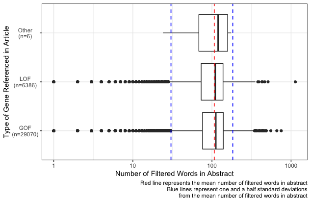

```{r setup, include=FALSE}
knitr::opts_chunk$set(echo = TRUE, message = FALSE, warning = FALSE)
```

This is a follow up blog post for one I wrote a couple of weeks ago, if you haven't read it then you can find it [here](https://www.hwarden.com/project/mutation-nlp/identifying-gene-characteristics-from-literature-using-machine-learning-data-collection/).

So I have now successfully downloaded abstracts related to various genes known to be either gain of function or loss of function and therefore very important in cancer. I have never done NLP before and I've decided to try and run before I walk (because it's more fun that way!), but one thing I do know is that it's really important to **get to know your data before you even touch a machine learning model**.

One thing to note is that I did go back to the code I made last time and rather than discarding articles that didn't fall into either the GOF or LOF category I just gave them the label `"Other"`. As I had no idea where to even start with this, a lot of the inspiration for this post came from [Julia Silge's](https://juliasilge.com/) brilliant post ['The Game Is Afoot! Topic Modeling Of Sherlock Holmes Stories'](https://juliasilge.com/blog/sherlock-holmes-stm/).

First thing is first, we need to load in our data.

```{r load data under the hood, echo=FALSE, message=FALSE, warning=FALSE}
library(tidyverse)
data <- read_delim("./data/processed_data.csv", delim = "\t")
```

```{r load data, eval=FALSE}
library(tidyverse)
data <- read_delim("./data/02_data_preprocessing/processed_data.csv", delim = "\t")
```

The problem now is that we want to analyse each individual word, not the abstracts as one long string. This might sound like a `stringr` nightmare, but luckily the `tidytext` package has got us covered

```{r token words}
library(tidytext)
words <- data %>%
  unnest_tokens(word, abstract) %>%
  select(pubmed_id, word)
```

```{r show words, echo=FALSE}
words
```

Now that we have access to each of the words individually, we need to try and find only the ones that are going to be useful. The `tidytext` package has a really useful list of common "filler" words that appear in normal speech called `stop_words`, so I used an anti-join to remove these from our pool of words. Then came a lot of reading up on regex that I had never really used before. I wanted to only focus on words (not numbers) so I removed all words that didn't contain at least one letter from A to Z; I removed any words that were of length 2 or less (as these were nearly all scientific units); I removed any words that had whitespace within them that hadn't been properly split by `unnest_tokens`. 

Then came a problem more specific to our context, there are a lot long random strings for some reason (probably some artefact of the web scraping process) like `"l9kttorshmefzacnbmjx2pbdck7g6hjkdutdt5psrahfrtq"`, but how do we tell them apart from long scientific compound words like `"acethylgalactosaminyltransferase"`? Looking at the long nonsense words they either looked like random strings or web adresses. To deal with the web addresses I removed any words that contained `"."`, `"_"` or `":"`. To deal with the random strings I realised that all the ones I looked at contained numbers but I couldn't remove any strings that had numbers in, as important genes have numbers in the (like P53) and I wanted those to stay in my data set. All the genes I know tend to have shorter names and so I settled for just removing all words that contained a number and were longer than 8 characters. I also removed any words that started with a number to try and stop any measurements (like `"3mm"`) from working their way into the dataset. This was the final result:

```{r}
# Filtering out unwanted words
filtered_words <- words %>%
  # Removing common words
  anti_join(stop_words) %>%
  mutate(
    # Removing whitespace from before and after each word
    word = str_trim(word),
    # Finding the length of each word
    len = str_length(word)
  ) %>%
  filter(
    # Keeping only words that contain at least one letter
    str_detect(word, "[A-Za-z]"),
    # Keeping words with three or more letters
    len > 2,
    # Removing words that start with a number
    str_starts(word, "[0-9]", negate = TRUE),
    # Removing words that contain whitespace
    str_detect(word, "\\s+", negate = TRUE),
    # Removing words containing specific pieces of punctuation
    str_detect(word, "\\.", negate = TRUE),
    str_detect(word, "\\_", negate = TRUE),
    str_detect(word, "\\:", negate = TRUE),
    # Removing any words with 9 or more letters that contain a number
    !(str_detect(word, "[0-9]") & (len > 8))
  )
```

We have more information than just the words though, we also know what articles they are from. We have seen that there are some long random strings in our dataset which suggests that our web scraping from my previous post may not have been as successful as first thought. To look at this, I counted the number of words in each abstract

```{r}
# Finding the number of filtered words in each abstract
word_count <- filtered_words %>%
  group_by(pubmed_id) %>%
  summarise(
    count = n()
  ) %>%
  # Adding gene_type information for each article
  left_join(
    data %>% select(pubmed_id, gene_type)
  )
```

I then plotted these results (all plotting code is in the [GitHub Repo](https://github.com/hwarden162/mutation_nlp))



As you can see, there are some suspiciously short and suspiciously long abstracts in this data set, bearing in mind that we have removed quite a few words. I played around with which abstracts to keep and which to discard, but I ended up settling with keeping a range 1.5 standard deviations around the mean (marked by the blue dashed lines in the plot).

```{r}
filtered_articles <- word_count %>%
  filter(
    count < mean(count) + 1.5*sd(count),
    count > mean(count) - 1.5*sd(count)
  )

filtered_articles_vector <- filtered_articles$pubmed_id

word_data <- filtered_words %>%
  filter(
    pubmed_id %in% filtered_articles_vector
  )
```


